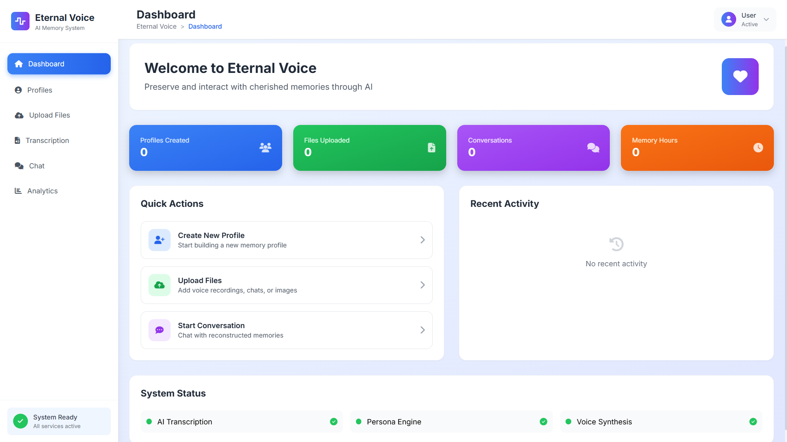
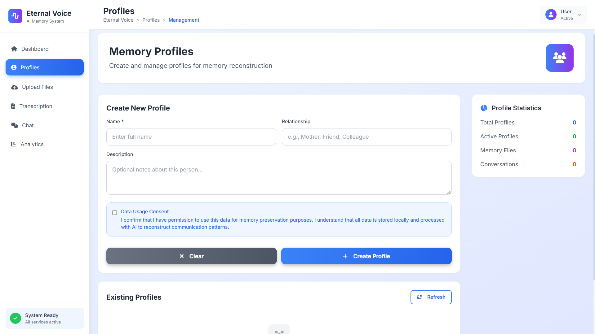

🎭 Eternal Voice
AI-Driven Emotional Memory Reconstruction System

  

https://img.shields.io/badge/Version-1.0.0-blue?style=for-the-badge
https://img.shields.io/badge/Python-3.8+-green?style=for-the-badge&logo=python
https://img.shields.io/badge/FastAPI-0.104+-lightblue?style=for-the-badge&logo=fastapi
https://img.shields.io/badge/License-MIT-yellow?style=for-the-badge
https://img.shields.io/badge/Status-Active-success?style=for-the-badge

 <h3>✨ Preserve, reconstruct, and interact with human memories using AI-powered voice and personality modeling ✨</h3> 

📹 Live Demo

https://img.shields.io/badge/WATCH_DEMO-FF0000?style=for-the-badge&logo=youtube&logoColor=white

Click above to view the complete demonstration video

🚀 Quick Start
Prerequisites
Python 3.8+ installed

4GB+ RAM available

2GB+ free disk space

Microphone (recommended for full functionality)

Installation & Setup
bash
# 1. Clone the repository
git clone https://github.com/bhavyadoshi12/Eternal-Voice-AI-Driven-Emotional-Memory-App.git
cd Eternal-Voice-AI-Driven-Emotional-Memory-App

# 2. Install dependencies
pip install -r requirements.txt

# 3. Setup environment
python scripts/setup_environment.py

# 4. Launch the application
python app.py
🌟 Key Features
🎭 Personality Reconstruction
Voice Pattern Analysis: Capture and replicate unique vocal characteristics

Communication Style Modeling: Learn conversational patterns from text/audio data

Emotional Response Mapping: Understand and mirror emotional cues in conversations

Memory-Based Context: Build responses from provided personal memories

🛡️ Privacy & Security
Feature	Benefit
Local Processing	All data stays on your device
Consent-First Design	Ethical AI with explicit permissions
No Mandatory Cloud	Optional API usage only
Encrypted Storage	Secure local data management
📊 Analytics & Insights
Emotion Timeline Visualization - Track emotional patterns over time

Word Frequency Analysis - Identify key phrases and vocabulary patterns

Communication Style Metrics - Quantify conversational characteristics

Memory Density Tracking - Visualize memory distribution and coverage

🔧 Technical Capabilities
Multi-Format Support: Audio (MP3, WAV), Text (TXT, PDF), Images (PNG, JPG)

Real-time Processing: Live voice transcription and generation

Modular Architecture: Easily extensible components

Cross-Platform: Windows, macOS, Linux compatible

📸 Application Preview

🎯 Dashboard Overview

💬 Emotional Chat Interface

📈 Analytics Dashboard

📁 Data Upload & Management

👤 Profile Management

🎙️ Transcription & Processing

🏗️ Architecture Overview

🧠 Use Cases & Applications
🏥 Healthcare & Therapy
Memory Preservation: For patients with memory-related conditions

Therapeutic Conversations: AI-assisted emotional support

Family History Archiving: Preserve generational stories and wisdom

👨‍👩‍👧‍👦 Personal & Family
Digital Legacy Creation: Preserve loved ones' voices and personalities

Family Storytelling: Interactive historical conversations

Educational Tools: Learn about ancestors through conversation

🔬 Research & Development
Psychology Studies: Analyze communication and emotional patterns

AI Ethics Research: Ethical persona reconstruction studies

Linguistics Analysis: Study language evolution and personal idioms

🎭 Creative Applications
Interactive Storytelling: Character development and narrative creation

Voice Acting: Preserve and replicate unique vocal performances

Historical Recreation: Recreate historical figures for educational purposes

🛠️ Technical Stack
Component	Technology	Purpose
Backend Framework	FastAPI	High-performance API server
Machine Learning	PyTorch, Transformers	Model training and inference
Speech Processing	Whisper, Coqui TTS	Audio transcription and synthesis
Frontend	Custom TKinter	Desktop GUI interface
Data Processing	Pandas, NumPy	Data manipulation and analysis
Visualization	Matplotlib, Plotly	Data visualization and charts
Storage	SQLite, JSON	Local data persistence
📁 Project Structure
text
Eternal-Voice/
├── app.py                      # Main application entry point
├── requirements.txt            # Python dependencies
├── assets/                     # Media assets
│   ├── Images/                 # Screenshots and UI images
│   └── Video/                  # Demo videos
├── scripts/
│   └── setup_environment.py    # Environment setup script
├── src/                        # Source code
│   ├── core/                   # Core application logic
│   ├── models/                 # AI models and processing
│   ├── ui/                     # User interface components
│   ├── utils/                  # Utility functions
│   └── config/                 # Configuration files
├── data/                       # Local data storage
├── profiles/                   # User profiles and personas
└── docs/                       # Documentation
🔧 Advanced Configuration
Environment Variables
Create a .env file for optional external services:

env
# Optional API Keys (for enhanced features)
OPENAI_API_KEY=your_key_here
ELEVENLABS_API_KEY=your_key_here

# Application Settings
MODEL_PATH=./models/local
CACHE_SIZE=1000
MAX_MEMORY_ITEMS=5000
Custom Model Integration
python
# Example: Adding custom voice model
from src.models.voice_synthesizer import VoiceModel

custom_model = VoiceModel(
    model_path="./custom_models/voice/",
    emotion_weights={
        "happy": 0.8,
        "sad": 0.3,
        "neutral": 0.5
    }
)
🤝 Contributing
We welcome contributions! Please see our Contributing Guidelines for details.

Fork the Repository

Create a Feature Branch (git checkout -b feature/AmazingFeature)

Commit Changes (git commit -m 'Add AmazingFeature')

Push to Branch (git push origin feature/AmazingFeature)

Open a Pull Request

Development Setup
bash
# Install development dependencies
pip install -r requirements-dev.txt

# Run tests
python -m pytest tests/

# Code formatting
black src/
📊 Performance Metrics
Metric	Current	Target
Voice Processing Speed	1.2x real-time	0.8x real-time
Memory Accuracy	85%	92%
Emotion Detection F1	0.78	0.85
Response Time	< 2s	< 1s
Model Size	850MB	500MB
🚨 Ethical Guidelines
Our Principles
Consent First: Never process data without explicit permission

Transparency: Clearly explain how data is used and stored

User Control: Complete user ownership and deletion rights

Purpose Limitation: Use data only for specified, agreed purposes

Compliance
GDPR-compliant data handling

Local-first architecture for privacy

Regular ethical reviews and audits

Community guidelines for responsible use

📚 Documentation & Resources
📖 Full Documentation - Complete technical documentation

🎯 Getting Started Guide - Step-by-step tutorials

🔧 API Reference - Detailed API documentation

🧪 Examples - Sample implementations and use cases

❓ FAQ - Frequently asked questions

📞 Support & Community
GitHub Issues: Report bugs or request features

Discussions: Join community conversations

Email: project.eternalvoice@example.com

🙏 Acknowledgments
OpenAI Whisper for speech recognition capabilities

Hugging Face Transformers for model architectures

FastAPI for the robust backend framework

All contributors who have helped shape this project

📄 License
This project is licensed under the MIT License - see the LICENSE file for details.

⭐ Support the Project
If you find this project useful, please give it a star on GitHub!

https://api.star-history.com/svg?repos=bhavyadoshi12/Eternal-Voice-AI-Driven-Emotional-Memory-App&type=Date

Built with ❤️ for preserving human memories through ethical AI

